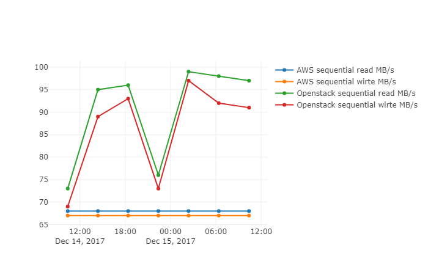
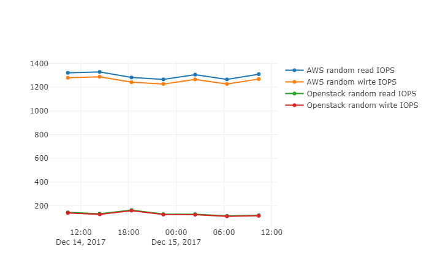

# Openstack list and boot benchmark

## Results
#### Openstack server list


#### Openstack boot VM


## Setup
On the Openstack VM
```
sudo apt-get update
sudo apt-get install openstack
```

To get the data
```
scp -i C:\.ssh\ccg10.pem ubuntu@10.200.2.172:simple-benchmark-master/measurements/* measurements\
```

Run the notebook