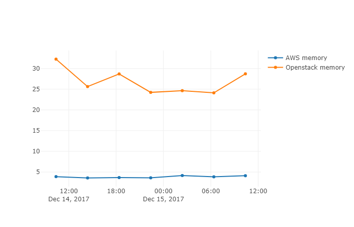
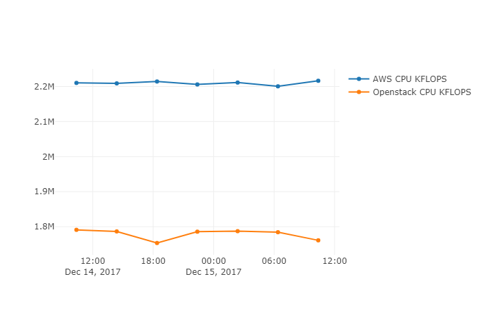

# Simple VM Benchmark

## Results
#### Sequential Disk read/write MB/s


#### Random Disk read/write IOPS


#### Memory access performance


#### CPU KFLOPS


## Setup
ssh on the AWS and Openstack VMs and run
```
sudo apt-get update
sudo apt-get install gcc fio unzip
wget https://github.com/birnbaum/simple-benchmark/archive/master.zip
unzip master.zip
cd simple-benchmark-master
python3 benchmark.py
```

Get the data from the machines
```
scp -i C:\.ssh\ccg10.pem ubuntu@10.200.2.172:simple-benchmark-master/measurements/* openstack\
scp -i C:\.ssh\devenv-key.pem ubuntu@35.157.236.67:simple-benchmark-master/measurements/* aws\
```

Run the notebook